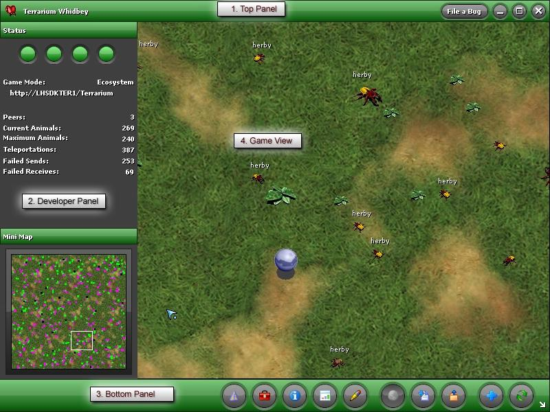

# Terrarium

Welcome to the .NET Terrarium 2.0 project! Terrarium was created by members of the .NET Framework team in the .NET Framework 1.0 timeframe and was used initially as an internal test application. At conferences and via online chats, Terrarium provided a great way for developers to learn about the new .NET programming model and languages as they developed creatures and introduced them into a peer-to-peer ecosystem. 

The Windows SDK team evolved the game in the .NET Framework 2.0 timeframe, but we haven't worked on it for over two years. As a result, the source code for Terrarium 2.0 doesn’t use the very latest .NET technologies. By making the source code available, we hope to provide a fun and interesting opportunity to learn about and use the latest advances in the .NET Framework. 

In Terrarium, you can create herbivores, carnivores, or plants and then introduce them into a peer-to-peer, networked ecosystem where they complete for survival. Terrarium demonstrates some of the features of the .NET Framework, including Windows Forms integration with DirectX®; XML Web services; support for peer-to-peer networking; support for multiple programming languages; the capability to update smart client, or Windows-based, applications via a remote Web server; and the evidence-based and code access security infrastructure. 

## Game Overview

The game can run in two modes:
* Terrarium Mode – 1) The user may run alone, without peers. In this case, the ecosystem presented on the screen represents the whole of the ecosystem. This is good for creature testing purposes. 2) The user may also elect to join with a select group of peers, expanding the ecosystem across all of the participating peer computers. This is simple to do. Each participating user opts into a special, private network by entering an agreed upon character string in the “channel” textbox on the Terrarium console. Upon entering that string, the user’s computer is matched with only those computers which also entered that same string.
* Ecosystem Mode – This is the standard mode, in which the user’s computer runs just a small slice of an ecosystem which spans all of the participating peer computers, worldwide.

In both modes, you can develop your own creatures or you can watch as other developers’ creatures battle it out for survival by running Terrarium as a standalone application or as a screensaver.

When creating a creature, you have control over everything from genetic traits (eyesight, speed, defensive power, attacking power, etc.) to behavior (the algorithms for locating prey, moving, attacking, etc.) to reproduction (how often a creature will give birth and what “genetic information,” if any, will be passed on to its offspring). Upon completing the development process, the code is compiled into an assembly (dynamically linked library, or DLL) that can be loaded into the local ecosystem slice, viewable through the Terrarium console. When a creature is initially introduced in Ecosystem Mode, ten instances of it are scattered throughout the local ecosystem. No more instances of that creature may be introduced by that user or any other on the network until the creature has died off completely. By contrast, if running in Terrarium Mode, an infinite number of instances of a given creature may be entered into the environment.

Once the creature is loaded into Terrarium, it acts on the instructions supplied by its code. Each creature is granted between 2 and 5 milliseconds (depending on the speed of the machine) to act before it is destroyed. This prevents any one creature from hogging the processor and halting the game.

Within each peer in the network, a blue “teleporter” ball rolls randomly about. If the user is running with active peers logged in (either in Ecosystem Mode or using a private channel in Terrarium Mode), whenever this blue ball rolls over a creature, that creature is transported to a randomly selected peer machine.
